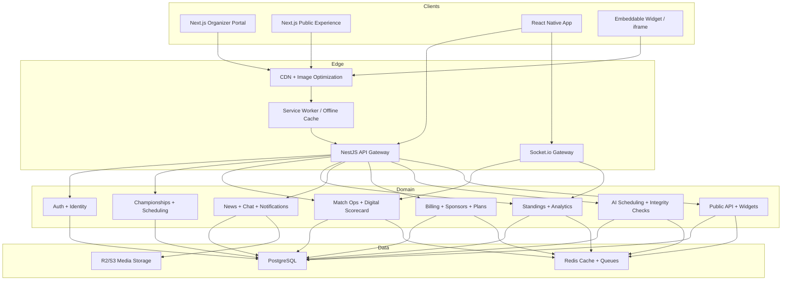
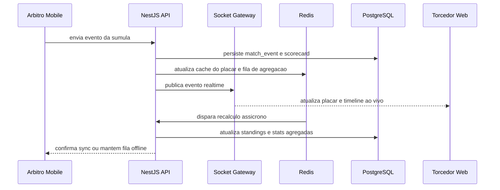

# Arquitetura do sistema

## Perfis e experiencias

### 1. Organizador

- Cria campeonatos, categorias, formatos e regras de classificacao
- Gerencia times, inscricoes, patrocinadores, arbitragem, financeiro e conteudo
- Acompanha dashboards, calendario semanal, relatorios e alertas operacionais

### 2. Jogador ou capitao

- Visualiza elenco, jogos, confirmacao de presenca e estatisticas pessoais
- Recebe notificacoes de partidas, punicoes, reagendamentos e resultados
- Acessa historico global da carreira dentro da plataforma

### 3. Torcedor

- Navega em campeonatos publicos sem conta
- Acompanha jogos, tabelas, placares ao vivo, noticias, fotos e comentarios
- Compartilha cards e embeds em redes sociais e sites parceiros

## Arquitetura em camadas

## Modulos do backend NestJS

- `auth`: JWT, refresh token, OAuth Google/Apple, RBAC e perfis
- `organizations`: ligas, staff, membership e assinaturas
- `championships`: campeonato, categoria, regulamento, formatos e configuracao
- `registrations`: formularios, limite de vagas, lista de espera e pagamento
- `teams`: times, escudos, elencos, capitaes e vinculos historicos
- `venues`: locais, quadras/campos, mapas e janelas de disponibilidade
- `scheduling`: geracao de tabela, sorteio ao vivo, seeding e reagendamento
- `matches`: partidas, sumula, arbitros, lances, assinaturas e arquivos
- `live`: placar ao vivo, cronometro, retransmissao websocket e fallback polling
- `stats`: classificacao, ranking, heatmaps, lideres e historico multi-campeonato
- `content`: noticias, stories, comentarios, reacoes, galerias e cards
- `notifications`: push, email, WhatsApp futuro e filas assicronas
- `billing`: planos, trial, cobranca recorrente, comissao e patrocinadores
- `public-api`: endpoints externos, widgets e documentacao Swagger
- `audit`: trilha de auditoria, deteccao de inconsistencias e eventos de seguranca

## Frontend web

- Dashboard do organizador com calendario semanal, KPIs e centro de acoes
- Central do capitao com elenco, presenca, punicoes e agenda
- Experiencia publica com pagina do campeonato, rodada, tabela e feed
- Painel de operacao da partida para desktop/tablet quando o arbitro estiver online

## App mobile React Native

- Modos dedicados para jogador, capitao, arbitro e staff
- Persistencia local para modo arbitro offline-first
- Scanner QR code para confirmacao de identidade
- Linha do tempo da partida com feedback visual para gol, cartao e substituicao

## Fluxo de dados principal

## Decisoes de arquitetura

- Monorepo com `pnpm` + Turborepo para compartilhar tipos, design system e SDKs
- REST para operacoes de escrita e integracoes externas
- GraphQL para consultas ricas de estatisticas, paginas publicas e dashboards complexos
- PostgreSQL como fonte de verdade; Redis para cache, pub/sub, rate limiting e jobs curtos
- WebSocket para placar ao vivo; fallback por polling de 30 segundos para ambientes restritos
- Storage de objetos para escudos, midia, PDFs e cards de resultados
- Multi-tenant por `organization_id`, com isolamento logico e trilha de auditoria

## Escalabilidade e seguranca

- Agregacoes assicronas para ranking e historico
- CDN para midia e paginas publicas cacheaveis
- RBAC por perfil e papel contextual por campeonato
- Assinatura digital da sumula com hash do documento final
- Logs de auditoria para toda alteracao sensivel
- LGPD: consentimento, exclusao logica e retention policy
